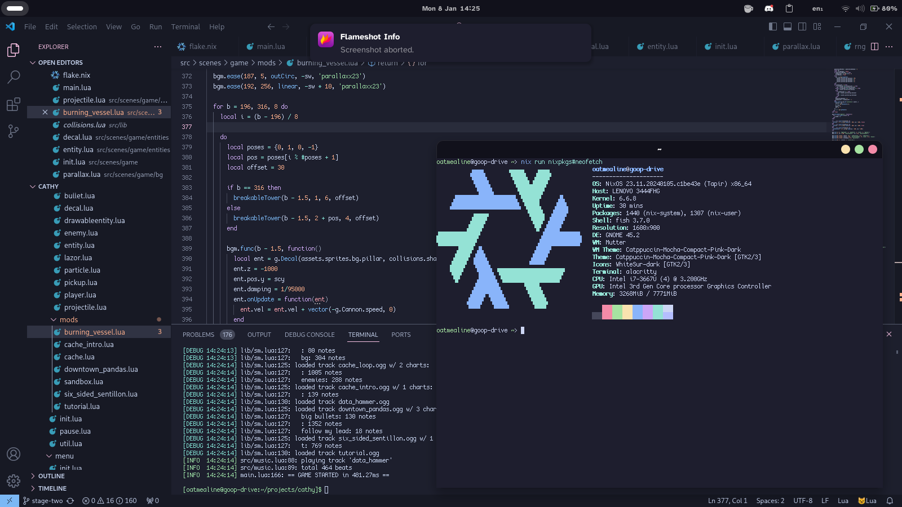
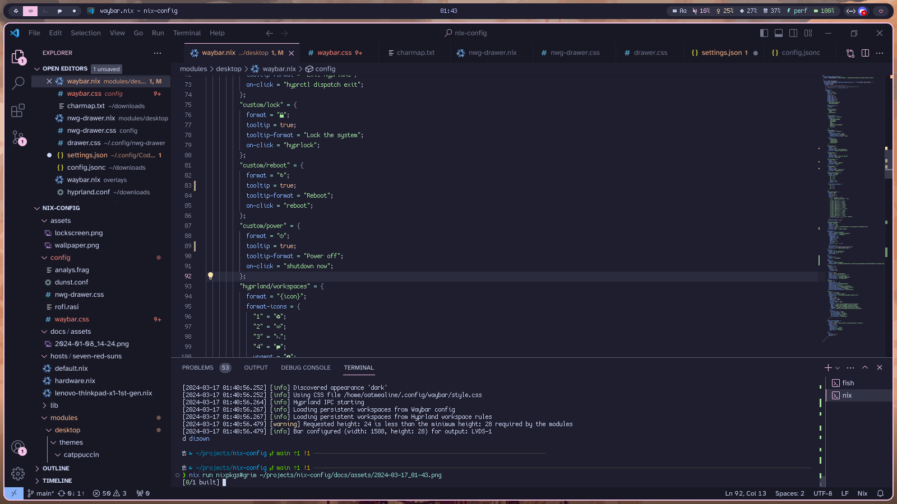

# nix-config

hello!! welcome to my little nix cave, home to `seven-red-suns` and potentially more hosts to come.

this is a nix flake managing my nixos systems. it isn't really ready for other peoples' use, but you are free to look around.

a lot of the base flake and module design was taken from [Icy-Thought's snowflake](https://github.com/Icy-Thought/snowflake) repo. thank you very much!!

## users

this flake assumes a single-user system for all hosts, enforced by `modules/user.nix`. this makes it much simpler to write modules that use both NixOS and `home-manager`, but also means that, well, you can't have more than one "main" user on the system. thus, it's not really suitable for larger servers.

## themes

different color schemes, icons and flavors are grouped into "themes", which you can look at in [`modules/desktop/themes/`](./modules/desktop/themes/). these are independent of desktop environments and display protocols and offer a nice abstraction over desktop customization in general

## screenshots

these are sorted by `theme - de`.

### Catppuccin - Gnome

### Catppuccin - Hyprland

